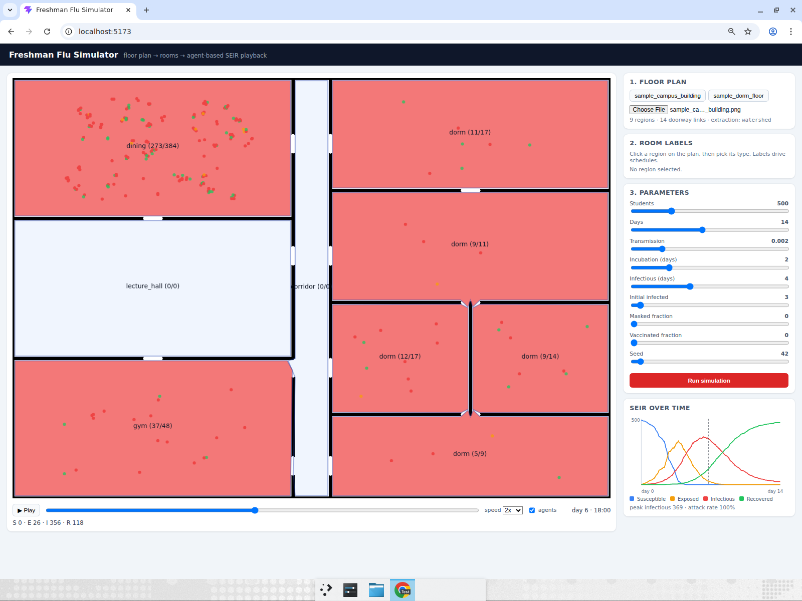

# Freshman Flu Simulator

Upload a floor-plan image of a university building, and the app extracts rooms and
corridors with OpenCV, runs an agent-based SEIR simulation of students moving through
those spaces, and plays the outbreak back on top of the plan.

## Quickstart (3 commands)

```bash
# 1. backend
cd backend && python3 -m venv .venv && .venv/bin/pip install -r requirements.txt && .venv/bin/python -m uvicorn app.main:app --port 8000

# 2. frontend (new terminal)
cd frontend && npm install && npm run dev

# 3. open
open http://localhost:5173
```

Then click a sample floor plan, optionally relabel regions, and hit **Run simulation**.



## How it works

### Layout extraction (`backend/app/layout.py`)
1. Otsu binarization -> free-space mask (walls black, walkable white).
2. Erosion sweep: several erosion radii are tried and the one producing the most
   room-sized seeds wins, which snaps doorways shut without dissolving small rooms.
3. Watershed over the full free space using those seeds -> one label per room/corridor.
4. Per region: contour polygon, centroid, pixel area, and a `corridor_score` from the
   distance transform (thin region => corridor).
5. Adjacency edges from dilating each region mask and seeing which labels it touches.
6. Labels are auto-guessed (corridor by thinness, then by area rank:
   lecture hall > dining > gym > dorm) and can be overridden in the UI.
7. **Fallback:** if segmentation yields fewer than two plausible regions, the free space
   is partitioned into a 6x4 grid so the simulation always has a layout to run on
   (`layout.method` reports `watershed` or `grid_fallback`).

The layout is persisted as JSON (`backend/data/<plan_id>/layout.json`), so the simulation
never touches the image again.

### Simulation (`backend/app/simulation.py`)
- NumPy-vectorized agent-based SEIR. Each student gets a daily schedule built from the
  labeled rooms (sleep in a dorm, morning/afternoon classes in lecture halls, meals in
  dining, evening gym, corridors in transit), with per-agent time shifts.
- 5-minute steps. Per step and per room, infection hazard is
  `1 - exp(-beta * I_room * density_factor * dt_hours * susceptibility)`, where
  `density_factor = median_area / room_area` (clipped), so crowded small rooms are riskier.
- E -> I and I -> R durations are gamma-distributed around the incubation/infectious
  parameters. Masks and vaccination are susceptibility multipliers.
- Fully deterministic given `seed`. 14 days x 500 agents runs in ~0.15 s.
- Output: full SEIR curve per 5-min step, plus hourly playback frames with per-room
  S/E/I/R counts and sampled positions for up to 250 rendered agents.

### API (`backend/app/main.py`)
| Method | Path | Purpose |
| --- | --- | --- |
| GET | `/api/samples` | list bundled sample floor plans |
| POST | `/api/plans/upload` | upload a PNG/JPG, returns extracted layout |
| POST | `/api/plans/sample/{name}` | ingest a bundled sample |
| GET | `/api/plans/{id}/layout` | extracted layout JSON |
| GET | `/api/plans/{id}/image` | the stored floor-plan image |
| PUT | `/api/plans/{id}/labels` | override region labels |
| POST | `/api/plans/{id}/simulate` | run a simulation, returns timeline |
| GET | `/api/plans/{id}/result` | last simulation result |

### Frontend (`frontend/`)
React + Vite + TypeScript, no chart or UI libraries. Canvas overlay on the floor plan
draws a per-room infection heatmap and animated agent dots (blue S, amber E, red I,
green R); side panel has the room-label editor, parameter sliders, a hand-rolled SVG
SEIR chart with a playhead, and play/pause + scrubber + speed controls.

## Samples

`backend/samples/` ships two synthetic plans (`sample_dorm_floor.png`,
`sample_campus_building.png`), regenerate with `python backend/tools/make_samples.py`.

## Known gaps

- Room polygons come from the largest external contour, so regions with holes are
  approximated; agent dots are sampled from a shrunken bounding box, not the polygon
  interior, so a dot can land slightly off inside L-shaped rooms.
- No PDF ingestion yet (PNG/JPG only).
- Schedules are a fixed hour-by-hour template; no weekends, no commuting between buildings.
- Storage is flat files on disk with no cleanup; there is no auth.
